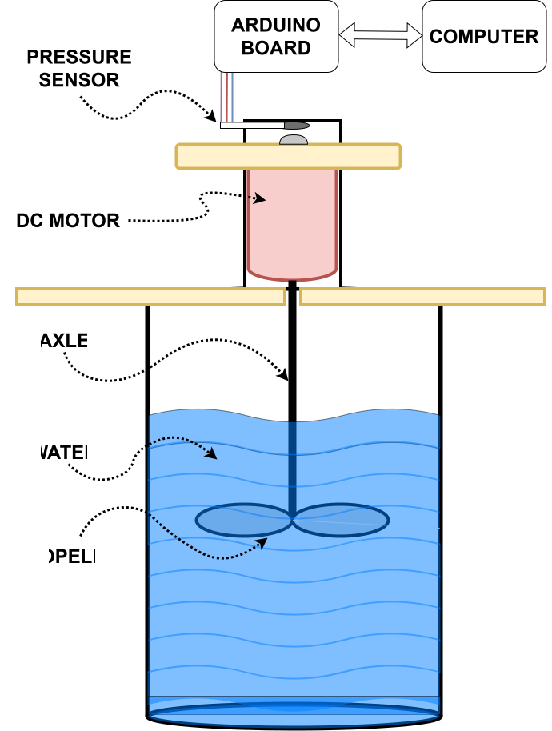
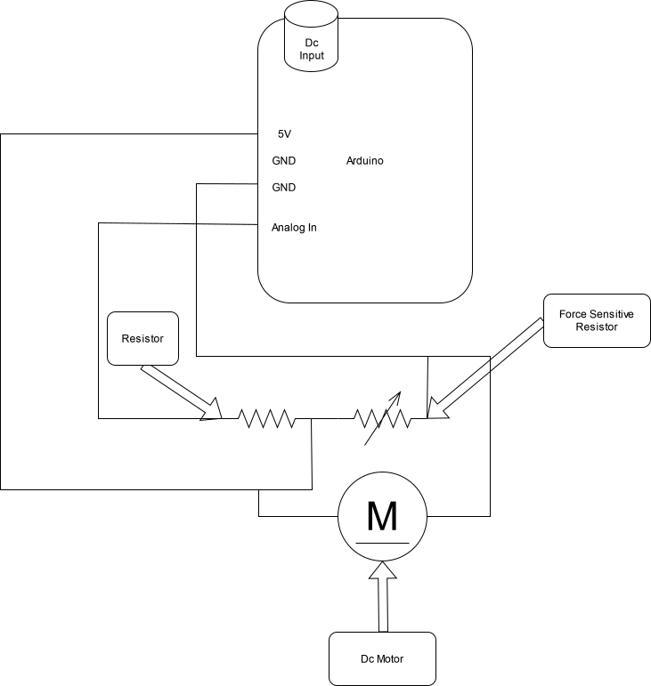

# Propeller Performance Analysis Project

Welcome to the repository for my Year 9 Science Fair project, focusing on analyzing the performance of different propeller designs. This project uses an Arduino to collect data and Python for visualizing and analyzing the results.

## Project Overview

The goal of this project is to test and compare the efficiency of various propeller designs by measuring key performance metrics such as thrust and torque. The testing mechanism includes an Arduino setup to collect sensor data, and a Python script for analyzing and visualizing the results.

## Repository Contents

- `arduin_program.ino`: Arduino sketch for data collection.
- `grapher.py`: Python script for data visualization.
- `results/`: Directory containing collected data samples.

## Testing Mechanism

The custom-built testing mechanism is designed to measure thrust and torque produced by different propeller designs. Below is a visual representation of the mechanism:



## Circuit Diagram

The Arduino and sensor connections are detailed in the circuit diagram:



## Project Highlights

- **Hardware**: A custom-built testing mechanism equipped with sensors to measure thrust and torque.
- **Data Collection**: Sensors interfaced with Arduino to log performance data for various propeller designs.
- **Data Visualization**: Python scripts to generate graphs for comparative analysis of propeller performance.

## Getting Started

### Arduino Setup

1. Connect the necessary sensors according to the provided circuit diagram.
2. Upload the `arduin_program.ino` sketch to the Arduino using the Arduino IDE.

### Propeller Testing

1. Mount the propeller to the testing mechanism as shown in the diagram.
2. Run the Arduino setup to collect thrust and torque data.
3. Save the collected data in the `results/` directory.

### Data Visualization

1. Ensure Python 3.x is installed on your system.
2. Install required Python libraries using pip:
   ```bash
   pip install matplotlib pandas
   ```
3. Execute the `grapher.py` script to generate comparative performance graphs:
   ```bash
   python grapher.py
   ```

## Requirements

- **Hardware**:
  - Arduino microcontroller
  - Sensors for thrust and torque measurement
  - Custom propeller testing mechanism

- **Software**:
  - Arduino IDE
  - Python 3.x
  - Python libraries: `matplotlib`, `pandas`

## Usage

1. Set up the testing mechanism and Arduino as outlined.
2. Test each propeller design and log the data.
3. Use the Python script to visualize and analyze the data.
4. Interpret the results to determine the most efficient propeller design.

## Contributing

This project is an educational endeavor, but suggestions and improvements are welcome. Feel free to fork the repository and submit pull requests.

## License

This project is open-source and available under the [MIT License](LICENSE).

---

*Note: This project is part of a Year 9 Science Fair focusing on propeller performance analysis.*

